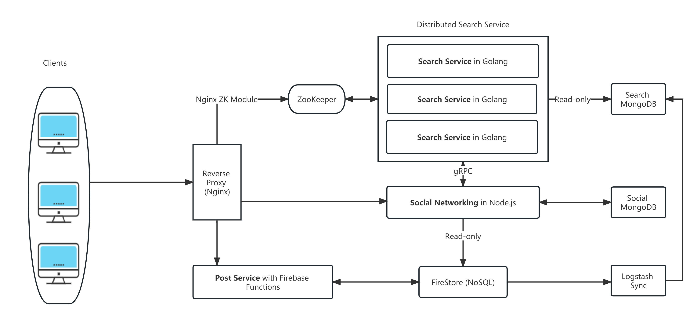

# UChicago Tree Hole Project

This is the repository for the UChicago Tree Hole Project. The project is an implementation of website for the UChicago students to anonymously post their thoughts and feelings. The website is built using __Firebase__ and __React__. Refer to the __backend__ section for more details.

## Backend:
The backend is a mixture of Firebase and Azure-hosted virtual machines. Redirect to the following link to find the repo for the backend codes:
 https://github.com/MuyanXie/Project-Tree-Hole-Backend

## Architecture

This project follows a __microservice__ architecture, with three sectors -- __Search Service, Social Service, and Post Service__. The frontend is built using React, and the backend is built with Node.js, Golang, and Firebase functions to utilize the benefits of each language/framework.



## Technical Highlights:
- React, with Redux and React Hooks heavily utilized
- Material UI for the Spring System
- Bootstrap UI for the Tree Hole Post System
- the post system is deployed serverlessly using Firebase
- the spring system is a new feature with a new server in Node.js added on Azure 
- the search system is deployed on a Zookeeper cluster with horizontal scaling capability
- the microservices will communicate using gRPC when necessary

## Getting Started
This platform is not able to be deployed on your own. The hosting is run on firebase and the database is run on Google Cloud Platform. For security measures, I've removed the firebase config file.


If you would like to run this project on your own, you will need to create a firebase project and inject a file called `firebase.js` into the `src` folder. The file should look like this:

```javascript
import { initializeApp } from "firebase/app";
import { getAuth } from "firebase/auth";
import { getFirestore } from "firebase/firestore";
import { getStorage } from "firebase/storage";

const firebaseConfig = {
  apiKey: "your-api-key",
  authDomain: "your-auth-domain",
  projectId: "your-project-id",
  messagingSenderId: "your-messaging-sender-id",
  appId: "your-app-id",
  measurementId: "your-measurement-id",
  storageBucket: "your-storage-bucket",
};

const app = initializeApp(firebaseConfig);

export const auth = getAuth(app);
export const db = getFirestore(app);
export const storage = getStorage(app);
```

Then running `npm start` will start the project on your local machine if you have the backend set up correctly. (You may need to run `npm install` first.) Please notice that the social_config.js file contains the backend url used, which is a test local url here. In the production environment, the url is changed to the production url.

## Access to the project

Please email muyanxiesam@uchicago.edu for access to the website of Tree Hole, since the feature is still in final phase of testing.

